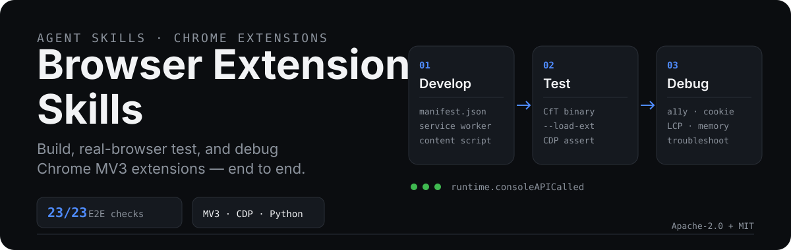
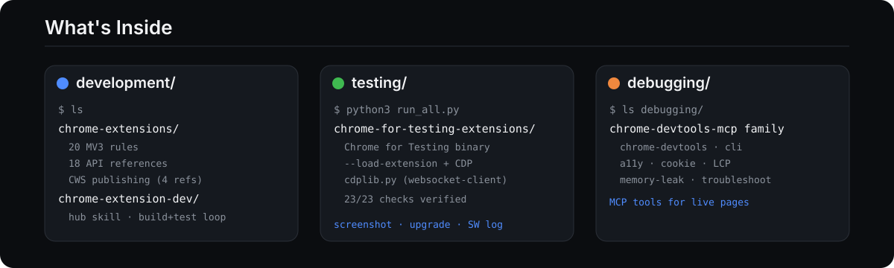

<p align="center">
  
</p>

# Browser Extension Skills

Agent skills for building, real-browser testing, and debugging Chrome browser extensions.
SKILL.md format — works with any coding agent that reads markdown skills (Hermes, Claude, Cursor, Codex, etc.).

## What's Inside

<p align="center">
  
</p>

| Layer | Skill | What it does |
|-------|-------|-------------|
| **development/** | `chrome-extensions` | Google Modern Web Guidance: 20 mandatory MV3 rules + 18 API references + CWS publishing guides |
| | `chrome-extension-dev` | Hub skill — routes by task type, ties the build+test loop together |
| **testing/** | `chrome-for-testing-extensions` | Real-browser E2E harness via CDP. Includes `scripts/cdplib.py` (websocket-client, 174 lines). Verified: 23/23 checks |
| **debugging/** | `chrome-devtools` · `chrome-devtools-cli` | MCP server skills for live page/extension debugging |
| | `a11y` · `cookie` · `LCP` · `memory-leak` · `troubleshooting` | Specialized audit and debugging skills |

## Quick Start

**Install** — clone and copy the skill dirs into your agent's skills folder:

```bash
git clone https://github.com/gandli/browser-extension-skills
cp -r browser-extension-skills/*/* ~/.hermes/skills/   # or your agent's skill dir
```

**Build an extension** — read `development/chrome-extensions/SKILL.md` for MV3 rules before writing any `manifest.json`.

**Test it for real** — read `testing/chrome-for-testing-extensions/SKILL.md`:

```bash
npx -y @puppeteer/browsers install chrome@stable   # Chrome for Testing (stable ignores --load-extension)
python3 run_all.py                                   # 23/23 E2E checks
```

**Debug it** — load `debugging/chrome-devtools/SKILL.md` or any specialized skill (a11y, cookies, LCP, memory leaks).

## Hard-Won Pitfalls

Lessons from a verified 23/23 E2E session. Each one cost real debugging time.

| Trap | What happens | Fix |
|------|-------------|-----|
| Chrome 137+ ignores `--load-extension` | Extension silently never loads, no error | Use **Chrome for Testing** (`npx @puppeteer/browsers install chrome@stable`) |
| `awaitPromise` + bare arrow function | `Runtime.evaluate` resolves to `{}` (the function object), no error | Always IIFE: `((async () => ...)())` |
| `Target.getTargets` shows component SWs | Evaluating in wrong context returns `{}` from storage | Filter service workers by your extension ID |
| `onInstalled reason=update` never fires | Fresh profile = `reason: install` every launch | Trigger in-session reload: click `#dev-reload-button` in chrome://extensions shadow DOM |
| Popup not CDP-exposable | `chrome.action.openPopup()` not available | `Target.createTarget` to open `popup.html` directly (identical DOM/JS context) |

## Sources

- `chrome-extensions/` — vendored from [Google Modern Web Guidance](https://github.com/nicolo-ribaudo/modern-web-guidance) v0.0.185 (Apache-2.0, Copyright Google LLC)
- `debugging/*` — vendored from [ChromeDevTools/chrome-devtools-mcp](https://github.com/ChromeDevTools/chrome-devtools-mcp) (Apache-2.0)
- `chrome-extension-dev/`, `chrome-for-testing-extensions/` — original, built from the verified test session above

## License

Original skills: MIT. Vendored skills remain under their Apache-2.0 license (NOTICE files preserved in each directory).
